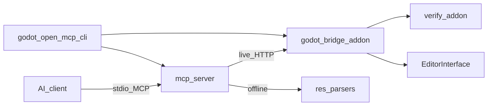

# Architecture

Godot Open MCP has four runtime parts:

- **Godot project** with bridge and verify addons installed (`addons/godot_open_mcp/`).
- **Bridge** — C# EditorPlugin, loopback HTTP, main-thread dispatch.
- **MCP server** — TypeScript stdio server, tool registry, routing.
- **CLI** — install, setup-mcp, open, wait-for-ready.

A desktop **Hub** app for guided setup is planned but deferred.

## Repository map

- `mcp-server/` — MCP stdio server, tool registry, routing.
- `packages/bridge/` — Godot HTTP bridge and typed tool handlers (shipped as `addons/godot_open_mcp/`).
- `packages/verify/` — validation rules and fixes used by gate flows.
- `cli/` — `godot-open-mcp-cli` command-line tooling.
- `skills/` — agent playbooks (`SKILL.md`).
- `demo/` — Godot C# demo project with fixtures.
- `scripts/` — version sync and maintenance scripts.

## Runtime flow

1. AI client calls an MCP tool.
2. MCP server chooses route policy.
3. Call goes to:
   - live bridge (preferred), or
   - offline/local readers (supported tools), or
   - local-only handlers (capabilities, manage_tools).
4. Response includes route metadata.

## Route types

- `live` — Godot Editor bridge is running and reachable.
- `offline` — disk readers for selected scene/resource/project operations (no editor required).
- `local` — no Godot call required (catalog-style operations).

Godot has no headless editor batch mode — there is no `batch` route.

## Godot-specific constraints

- Single C# assembly — use `#if TOOLS` for editor-only code. Runtime must not leak editor APIs.
- Paths are `res://`; scenes are `.tscn`; resources are `.tres`/`.res`.
- All `EditorInterface` / `Node` API calls run on the main thread via a dispatcher.
- v1 requires **Godot 4.3+ mono (C#/.NET 8)**.

## Multi-instance port + discovery

Multiple Godot projects can run bridges simultaneously without port collisions. The bridge port is **deterministic per project**: `20000 + (sha256(normalizedProjectPath) % 10000)`, where the hash uses the first 8 bytes of SHA256 as a big-endian `UInt64` so the C# bridge and the TypeScript MCP server agree byte-for-byte. The `GODOT_OPEN_MCP_BRIDGE_PORT` env var overrides the deterministic default.

Each running bridge owns a lock file at `~/.godot-open-mcp/instances/<sha256(projectPath)>.json` carrying the PID, port, project path/hash, and editor state (idle/compiling/playing/...). The MCP server reads these to discover the right port per project without an HTTP round-trip. Stale locks (from a crashed editor) are swept on the next `Acquire` by PID-liveness; the MCP server is read-only on the lock.

## Core source files (planned)

- `mcp-server/src/index.ts`
- `mcp-server/src/tool-router.ts`
- `mcp-server/src/instance-discovery.ts`
- `packages/bridge/plugin.cfg` — addon metadata; installed as `addons/godot_open_mcp/plugin.cfg`.
- `packages/bridge/Editor/GodotOpenMcpPlugin.cs` — editor entry point; owns bridge enable/disable lifecycle (installs the dispatcher, caches session state, starts/stops the HTTP listener).
- `packages/bridge/Runtime/MainThread/MainThreadDispatcher.cs` — pumps off-thread work onto the editor main thread via a long-lived `Node._Process` tick; the single dispatch path all editor API calls route through.
- `packages/bridge/Editor/Bridge/BridgeHttpServer.cs` — loopback `HttpListener` + listener thread; serves `GET /ping` (P1.3) and will host tool dispatch / events / auth in later phases.
- `packages/bridge/Editor/Bridge/BridgeSession.cs` — process-wide session state read by `/ping` (project path, Godot version, connected/compiling/playing flags, bridge version).
- `packages/bridge/Editor/Bridge/BridgeBindAddress.cs` — loopback-only bind decision (P1.3); widens to remote+auth in P5.2.
- `packages/bridge/Editor/Bridge/InstancePortResolver.cs` — per-project deterministic port (`20000 + sha256(path) % 10000`) and `~/.godot-open-mcp/instances/<hash>.json` lock path (P1.4). Mirrors `mcp-server/src/instance-discovery.ts` byte-for-byte.
- `packages/bridge/Editor/Bridge/BridgeInstanceLock.cs` — instance lock + heartbeat file lifecycle (Acquire/UpdateState/Release, stale-lock sweep by PID liveness) for multi-instance port discovery (P1.4).

## Versioning

The repo tracks a shared version for the npm MCP server, bridge addon, and verify addon from `version.json`. Generated version strings are synced by `scripts/sync-version.mjs`.

## Related docs

- [API index](api.md)
- [Porting principles](porting-principles.md)
- Detailed API docs (TBD): `api/mcp-tools.md`, `api/bridge-http.md`, `api/resources.md`
