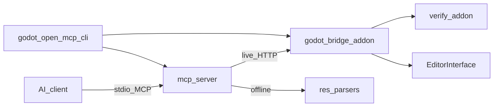

# Architecture

Godot Open MCP has four runtime parts:

- **Godot project** with bridge and verify addons installed (`addons/godot_open_mcp/`).
- **Bridge** — C# EditorPlugin, loopback HTTP, main-thread dispatch.
- **MCP server** — TypeScript stdio server, tool registry, routing.
- **CLI** — install, setup-mcp, open, wait-for-ready.

A desktop **Hub** app for guided setup is planned but deferred.

## Repository map

- `mcp-server/` — MCP stdio server, tool registry, routing.
- `packages/bridge/` — Godot HTTP bridge and typed tool handlers (shipped as `addons/godot_open_mcp/`).
- `packages/verify/` — validation rules and fixes used by gate flows.
- `cli/` — `godot-open-mcp-cli` command-line tooling.
- `skills/` — agent playbooks (`SKILL.md`).
- `demo/` — Godot C# demo project with fixtures.
- `scripts/` — version sync and maintenance scripts.

## Runtime flow

1. AI client calls an MCP tool.
2. MCP server chooses route policy.
3. Call goes to:
   - live bridge (preferred), or
   - offline/local readers (supported tools), or
   - local-only handlers (capabilities, manage_tools).
4. Response includes route metadata.



## Route types

- `live` — Godot Editor bridge is running and reachable.
- `offline` — disk readers for selected scene/resource/project operations (no editor required).
- `local` — no Godot call required (catalog-style operations).

Godot has no headless editor batch mode — there is no `batch` route.

## Godot-specific constraints

- Single C# assembly — use `#if TOOLS` for editor-only code. Runtime must not leak editor APIs.
- Paths are `res://`; scenes are `.tscn`; resources are `.tres`/`.res`.
- All `EditorInterface` / `Node` API calls run on the main thread via a dispatcher.
- v1 requires **Godot 4.3+ mono (C#/.NET 8)**.

## Runtime / Editor boundary

Godot compiles the entire bridge addon into **one** C# assembly — there is no per-folder
assembly boundary the way Unity's asmdefs provide. What keeps editor-only code out of a
shipped game build is the `TOOLS` compilation symbol, which Godot defines **only** for the
editor (`Debug`) configuration and leaves undefined for `ExportDebug` / `ExportRelease`.
Code wrapped in `#if TOOLS … #endif` is compiled into the editor and stripped from an
exported game.

The bridge mirrors that split at the folder level so the boundary is visible at a glance:

- `packages/bridge/Runtime/` — ships into a game build. Must not reference any editor-only
  Godot API in real code.
- `packages/bridge/Editor/` — editor-only (`EditorPlugin`, the HTTP bridge, tool handlers).
  Always wrapped in `#if TOOLS`.

The load-bearing invariant is one-directional: **Editor code may reference Runtime code;
Runtime code may NEVER reference Editor code.** A `Runtime/` file that referenced an
editor-only type (`EditorInterface`, `EditorPlugin`, `EditorFileSystem`, `EditorScript`)
in shipping code would either fail the `ExportRelease` compile or drag editor behaviour
into a context where no editor exists.

### CI boundary guard

`scripts/check-runtime-boundary.py` enforces the rule on every PR (wired into
`.github/workflows/ci.yml` as the fast `Runtime/Editor boundary guard` job, which runs
before any .NET build). It scans `packages/bridge/Runtime/**/*.cs` and **exits non-zero**
if any file references an editor-only API in real code that is:

- **not** inside a `#if TOOLS … #endif` guard, and
- **not** inside a comment or string literal, and
- **not** explicitly suppressed.

The check is comment- and string-aware on purpose: runtime files mention editor type names
heavily in doc-comments and `[Description("…")]` strings to *explain* the boundary, and
those are not violations — only un-guarded code is. This mirrors exactly what the
`ExportRelease` (TOOLS-undefined) compile strips, but runs in milliseconds with no build.

A `#if TOOLS` block in `Runtime/` is allowed only as a narrow, documented editor-coupling
shim (the guarded body is stripped from the game build, so it cannot leak). Such shims are
reported as a warning under `--verbose`, not a failure.

Run it locally any time:

```bash
python scripts/check-runtime-boundary.py            # 0 = boundary holds, 1 = violation
python scripts/check-runtime-boundary.py --verbose  # also lists #if TOOLS shims + suppressions
```

This guard is a fast pre-filter; the authoritative proof that the boundary holds is that
the `ExportRelease` (TOOLS-undefined) configuration **compiles** and the resulting assembly
contains the runtime types and none of the editor types.

### Suppressions (justified exceptions)

The default policy is "no editor APIs in `Runtime/` real code outside `#if TOOLS`." For the
rare case where a `Runtime/` file must reference an editor type in shipping code, append a
trailing `// boundary:allow <audit-note>` line comment on the **same line** as the token:

```csharp
var name = nameof(EditorInterface); // boundary:allow ADR-XYZ forwarded type name
```

The audit note (anything non-empty after `boundary:allow`) is mandatory so the exception is
visible in code review and under `--verbose` in CI output. This is the **only** suppression
path — do not silence the guard by other means.

## Multi-instance port + discovery

Multiple Godot projects can run bridges simultaneously without port collisions. The bridge port is **deterministic per project**: `20000 + (sha256(normalizedProjectPath) % 10000)`, where the hash uses the first 8 bytes of SHA256 as a big-endian `UInt64` so the C# bridge and the TypeScript MCP server agree byte-for-byte. The `GODOT_OPEN_MCP_BRIDGE_PORT` env var overrides the deterministic default.

Each running bridge owns a lock file at `~/.godot-open-mcp/instances/<sha256(projectPath)>.json` carrying the PID, port, project path/hash, and editor state (idle/compiling/playing/...). The MCP server reads these to discover the right port per project without an HTTP round-trip. Stale locks (from a crashed editor) are swept on the next `Acquire` by PID-liveness; the MCP server is read-only on the lock.

## Phase 1 parity smoke

The bridge spine (Phase 1) has one canonical end-to-end gate that must pass before Phase 2 work begins: **MCP client → stdio MCP server → `godot_open_mcp_ping` → bridge `GET /ping`**. The smoke catches port-formula drift, envelope regressions, and tool-registry breakage early — on every PR via the in-process integration test, and on demand via the scripted smoke against the built `dist/index.js`.

**Two complementary gates:**

1. **In-process integration test** — `mcp-server/src/integration.test.ts`. Wires an MCP SDK `Client` to `createServer` over `InMemoryTransport` with a `LiveClient` aimed at a loopback HTTP stub. Runs on every `npm test`. Covers the healthy round-trip plus the actionable-failure paths (`bridge_offline`, `bridge_http_error`, 503 bridge-loading).
2. **Scripted stdio smoke** — `mcp-server/scripts/p1-parity-smoke.mjs` (`npm run smoke:p1`). Spawns the real `dist/index.js` over stdio, drives it with an SDK `StdioClientTransport`, and asserts the same route against a real OS-level child process. Run it before tagging a Phase 1 release or after any change to the boot path.

```bash
# from mcp-server/, after `npm run build`
npm run smoke:p1
```

**Pass criteria:** exit 0, with both the healthy ping body and the structured `bridge_offline` failure observed.

### Failure signatures

Every smoke failure surfaces a structured error whose first field names the **owner area**. The table maps each signature to its cause and the contract that drifted.

| Signature | Meaning | Owner area | Likely cause |
|---|---|---|---|
| `{"error":{"code":"bridge_offline", ...}}` with a `~/.godot-open-mcp/instances/<hash>.json` hint | No listener at the resolved port. | instance discovery + lock | Port formula mismatch (TS ↔ C# drift), Godot not running, wrong project path, stale lock with a live PID. |
| `{"error":{"code":"bridge_timeout", ...}}` "did not respond within Nms" | Listener is up but too slow to answer. | bridge HTTP / main thread | Editor stalled on a long main-thread op; bridge worker thread starved. |
| `{"error":{"code":"bridge_http_error", ...}}` "unexpected HTTP NNN" | Listener returned an unexpected status (not 200 / 503). | bridge HTTP routing | Route handler change, missing `BridgeSession` init, auth gate (later phase) rejecting the probe. |
| `isError:false` + `connected:false, compiling:true` (HTTP 503 fallback body) | Bridge listener up, session not ready yet. | bridge session lifecycle | Normal editor reload in flight — treat as reachable, not failed. |
| `tools/list` does NOT include `godot_open_mcp_ping` | Tool registry drift. | MCP tool catalog | `tools/index.ts` no longer exports `ping`; `ALL_TOOLS` mutated incorrectly. |
| `Unknown tool: godot_open_mcp_ping` from `tools/call` | Registry / dispatcher mismatch. | MCP tool catalog | Tool name spelling drifted, or `handleCallTool` registry check broken. |

The **actionable hint** in every `bridge_offline` payload names this project's exact lock file path and (when the lock is readable) its port/pid/state — so an agent or human debugging a failure knows exactly where to look without re-deriving the hash.

### Phase exit gate

Phase 2 must not start until the parity smoke is green on a clean checkout. The roadmap ([Phase 1 exit gate](../specs/roadmap.md)) ties Phase 2 entry to this gate; reference the smoke result explicitly in the Phase 1 completion record.

## Core source files (planned)

- `mcp-server/src/index.ts` — stdio MCP bootstrap; wires the SDK `Server` to a `StdioServerTransport`, registers `ListTools` / `CallTool` against the tool registry, exits cleanly on transport close.
- `mcp-server/src/tools/index.ts` — tool registry; `godot_open_mcp_ping` (P1.7), `godot_open_mcp_node_find` (P2.2), `godot_open_mcp_node_create` (P2.3), `godot_open_mcp_node_modify` (P2.4), the three tree-ops `node_set_parent` / `node_duplicate` / `node_delete` (P2.5), the scene lifecycle tools `scene_open` / `scene_save` / `scene_list_opened` (P2.6), and the scene data tools `scene_get_data` / `scene_create` (P2.7) are the first entries. Subsequent phases append editor / gate / capability tools.
- `mcp-server/src/tools/ping.ts` — `godot_open_mcp_ping` tool definition (catalog metadata only; the call path lives in `live-client.ts`).
- `mcp-server/src/tools/node-find.ts` — `godot_open_mcp_node_find` tool definition (P2.2); the first read-only editor tool. Godot-adapted schema: `node_path` / `name` (targeted resolvers), `type` / `name_contains` (list filters), `hierarchy_depth`, `max_results`.
- `mcp-server/src/tools/node-create.ts` — `godot_open_mcp_node_create` tool definition (P2.3); the first mutating editor tool. Two creation modes (`type_class_name` via ClassDB, `instance_scene_path` PackedScene instancing) plus optional `parent_node_path` / transform fields. `paths_hint` / `gate` are forward-compat no-ops until the gate flow (P3.5).
- `mcp-server/src/tools/node-modify.ts` — `godot_open_mcp_node_modify` tool definition (P2.4); single (`node_path`) + batch (`node_paths`) property mutation via a `properties` map and flat transform convenience fields. Unsupported properties produce warnings (non-aborting). `paths_hint` / `gate` forward-compat no-ops until P3.5.
- `mcp-server/src/tools/node-set-parent.ts` — `godot_open_mcp_node_set_parent` tool definition (P2.5); cycle-safe reparent via Godot `Node.Reparent`, `keep_global_transform` replaces Unity's `world_position_stays`.
- `mcp-server/src/tools/node-duplicate.ts` — `godot_open_mcp_node_duplicate` tool definition (P2.5); `Node.Duplicate` sub-tree copy with optional `new_name` / cross-parent `parent_node_path`.
- `mcp-server/src/tools/node-delete.ts` — `godot_open_mcp_node_delete` tool definition (P2.5); single + batch delete via synchronous `Node.Free`, with an optional `fail_if_has_children` leaf guard.
- `mcp-server/src/tools/scene-open.ts` — `godot_open_mcp_scene_open` tool definition (P2.6); opens a `res://*.tscn` scene in the editor. `ignore_dirty` (default false) replaces Unity's `ignore_scene_dirty`; the bridge refuses a dirty open rather than popping Godot's native save modal. Unity's additive/single `mode` is dropped (Godot opens scenes in tabs). `paths_hint` / `gate` forward-compat no-ops until P3.5.
- `mcp-server/src/tools/scene-save.ts` — `godot_open_mcp_scene_save` tool definition (P2.6); three modes — `save_all` (iterate open scene tabs), `path` (save-as to a new `res://` path), or neither (save edited scene to its file). Save-as verifies the edited scene's path was re-pointed (Godot's `SaveSceneAs` returns no error code).
- `mcp-server/src/tools/scene-list-opened.ts` — `godot_open_mcp_scene_list_opened` tool definition (P2.6); read-only, no args. Returns `scenes[]` (SceneSummary: path, name, isDirty, rootType, isActive) plus `editedPath`. The active scene carries root name/type; non-active open scenes report path + file stem only (Godot 4.3 has no root accessor for non-active scenes).
- `mcp-server/src/tools/scene-get-data.ts` — `godot_open_mcp_scene_get_data` tool definition (P2.7); read-only live hierarchy snapshot of the edited scene. `hierarchy_depth` (default 1, capped at 5; -1 = whole tree) drives a NodeData tree walk; Unity's profile/detail/paging surface collapses to the single depth axis for the P2.7 live read. `path` optional — asserts the edited scene matches, otherwise `scene_not_edited` (offline `.tscn` parse lands in P7.2).
- `mcp-server/src/tools/scene-create.ts` — `godot_open_mcp_scene_create` tool definition (P2.7); creates a new `.tscn` at a `res://` path and (by default) opens it. `root_type` (default `Node2D`) replaces Unity's `setup`; `root_name` defaults to a PascalCased filename stem; `overwrite` (default false) guards existing paths; `open` (default true) controls whether the new scene becomes active. `paths_hint` / `gate` forward-compat no-ops until P3.5.
- `mcp-server/src/live-client.ts` — live bridge client; routes registered tool calls into bridge HTTP. `godot_open_mcp_ping` round-trips via `GET /ping` (P1.7); every other tool dispatches via `POST /tools/{name}` and unwraps the canonical `{ ok, result, error }` envelope (P2.1).
- `mcp-server/src/results.ts` — shared `CallToolResult` error factory (`{ error: { code, message } }` envelope); reused by every error path so the wire shape stays consistent.
- `mcp-server/src/instance-discovery.ts` — per-project bridge port + auth token resolution from instance locks; mirrors `InstancePortResolver.cs` byte-for-byte.
- `mcp-server/src/integration.test.ts` — P1.9 phase-gate parity smoke (in-process): MCP SDK `Client` + `InMemoryTransport` + `LiveClient` + loopback bridge stub drives the full `godot_open_mcp_ping` → bridge `/ping` route on every `npm test`.
- `mcp-server/scripts/p1-parity-smoke.mjs` — P1.9 scripted stdio smoke: spawns the built `dist/index.js` as a child process and verifies the parity route over a real stdio pipe (`npm run smoke:p1`).
- `mcp-server/src/tool-router.ts` — live/offline/local route selection (planned).
- `packages/bridge/plugin.cfg` — addon metadata; installed as `addons/godot_open_mcp/plugin.cfg`.
- `packages/bridge/Editor/GodotOpenMcpPlugin.cs` — editor entry point; owns bridge enable/disable lifecycle (installs the dispatcher, caches session state, starts/stops the HTTP listener).
- `packages/bridge/Runtime/MainThread/MainThreadDispatcher.cs` — pumps off-thread work onto the editor main thread via a long-lived `Node._Process` tick; the single dispatch path all editor API calls route through.
- `packages/bridge/Editor/Bridge/BridgeHttpServer.cs` — loopback `HttpListener` + listener thread; serves `GET /ping` (P1.3) and `POST /tools/{name}` dispatch (P2.1), marshaling handlers to the main thread via `MainThreadDispatcher`.
- `packages/bridge/Editor/Bridge/BridgeSession.cs` — process-wide session state read by `/ping` (project path, Godot version, connected/compiling/playing flags, bridge version).
- `packages/bridge/Editor/Bridge/BridgeEnvelope.cs` — canonical `{ ok, result, error }` response envelope builders (P2.1).
- `packages/bridge/Editor/Bridge/BridgeRequestBody.cs` — request-body reader + `timeout_ms` extraction/clamping for tool dispatch (P2.1).
- `packages/bridge/Editor/Tools/BridgeToolRegistry.cs` — name→handler tool registry + the `godot_open_mcp_echo` smoke stub (P2.1).
- `packages/bridge/Editor/Tools/ToolDispatchResult.cs` — tool dispatch result model (success output / failure code+message) (P2.1).
- `packages/bridge/Editor/Tools/NodeTools.cs` — node tool family handlers (P2.2 find, P2.3 create, P2.4 modify, P2.5 set-parent / duplicate / delete): `node_find` does targeted lookup by `node_path` / `name` and list mode with `type` / `name_contains` filters; `node_create` is the first mutating tool (ClassDB instantiation or PackedScene instancing, with Owner assignment to the edited scene root so the new node persists on save); `node_modify` mutates properties on single + batch targets (warnings for unsupported keys, non-aborting); the three P2.5 tree ops cover reparent (cycle-safe via `Node.Reparent`), duplicate (`Node.Duplicate` sub-tree copy), and delete (synchronous `Node.Free`, root-delete refused). Shared `ResolveNode` / `ResolvePath` / `ToNodeData` / `SetOwnerRecursive` helpers serve all node tools. Editor-only (`#if TOOLS`).
- `packages/bridge/Editor/Tools/NodeData.cs` — pure-managed Node snapshot DTO with self-serialization via `BridgeJson` (P2.2); the Godot analog of Unity's per-GameObject summary.
- `packages/bridge/Editor/Tools/NodeFindBody.cs` — pure-managed request-body parser for `node_find` (P2.2); hand-rolled scalar extraction matching `BridgeRequestBody`'s no-JSON-DOM style.
- `packages/bridge/Editor/Tools/NodeCreateBody.cs` — pure-managed request-body parser for `node_create` (P2.3); same hand-rolled scalar-extraction style, with `instance_scene_path` taking precedence over `type_class_name`.
- `packages/bridge/Editor/Tools/NodeModifyBody.cs` — pure-managed request-body parser for `node_modify` (P2.4); extends the hand-rolled scalar style with a string-array extractor (`node_paths`) and a string-map extractor (`properties`); reused by the P2.5 delete handler for its batch targets.
- `packages/bridge/Editor/Tools/NodePathNormalizer.cs` — pure-string scene-tree path normalization (P2.2); strips `/root/` / leading-slash / edited-root-name prefixes so `GetNodeOrNull` resolves against the edited scene root.
- `packages/bridge/Editor/Tools/SceneTools.cs` — scene tool family handlers (P2.6 lifecycle, P2.7 data + create): `scene_open` opens a `res://*.tscn` scene with a dirty-scene guard (`scene_dirty` refusal by default, `ignore_dirty` opt-out); `scene_save` covers save-current / save-as (verified by re-reading the edited scene's path) / save-all (iterates open-scene tabs); `scene_list_opened` enumerates open scenes + flags the active one; `scene_get_data` (P2.7) returns a live NodeData tree of the edited scene driven by `hierarchy_depth` (reuses `NodeTools.ToNodeData`); `scene_create` (P2.7) builds a new `.tscn` via `PackedScene.Pack` + `ResourceSaver.Save` and opens it. Owns the bridge-tracked dirty flag (`MarkEditedSceneDirty`), set by the `NodeTools` mutators alongside `MarkSceneAsUnsaved` and cleared on save/open — Godot 4.3 has no public dirty-state query API, so this catches agent-driven mutations but not human edits (an intentional delta from Unity). Editor-only (`#if TOOLS`).
- `packages/bridge/Editor/Tools/SceneSummary.cs` — pure-managed scene snapshot DTO with self-serialization via `BridgeJson` (P2.6); the Godot analog of Unity's per-scene summary, carrying path / name / isDirty / rootType / isActive.
- `packages/bridge/Editor/Tools/SceneOpenBody.cs` — pure-managed request-body parser for `scene_open` (P2.6); `path` + `ignore_dirty` scalars via the same hand-rolled extraction style as the node `*Body` parsers.
- `packages/bridge/Editor/Tools/SceneSaveBody.cs` — pure-managed request-body parser for `scene_save` (P2.6); optional `path` (save-as) + `save_all` bool, with `IsSaveAll` / `IsSaveAs` mode flags for the handler.
- `packages/bridge/Editor/Tools/SceneGetDataBody.cs` — pure-managed request-body parser for `scene_get_data` (P2.7); optional `path` + `hierarchy_depth` (default 1, positive capped at 5, -1 = unlimited → `EffectiveDepth` translates to `int.MaxValue` for the depth-counted walker).
- `packages/bridge/Editor/Tools/SceneCreateBody.cs` — pure-managed request-body parser for `scene_create` (P2.7); `path` + optional `root_type` (default `Node2D`) + `root_name` + `overwrite` (default false) + `open` (default true), with `EffectiveRootType` fallback.
- `packages/bridge/Editor/Bridge/BridgeBindAddress.cs` — loopback-only bind decision (P1.3); widens to remote+auth in P5.2.
- `packages/bridge/Editor/Bridge/InstancePortResolver.cs` — per-project deterministic port (`20000 + sha256(path) % 10000`) and `~/.godot-open-mcp/instances/<hash>.json` lock path (P1.4). Mirrors `mcp-server/src/instance-discovery.ts` byte-for-byte.
- `packages/bridge/Editor/Bridge/BridgeInstanceLock.cs` — instance lock + heartbeat file lifecycle (Acquire/UpdateState/Release, stale-lock sweep by PID liveness) for multi-instance port discovery (P1.4).

## Versioning

The repo tracks a shared version for the npm MCP server, bridge addon, and verify addon from `version.json`. Generated version strings are synced by `scripts/sync-version.mjs`.

## Related docs

- [API index](api.md)
- [Porting principles](porting-principles.md)
- Detailed API docs (TBD): `api/mcp-tools.md`, `api/bridge-http.md`, `api/resources.md`
